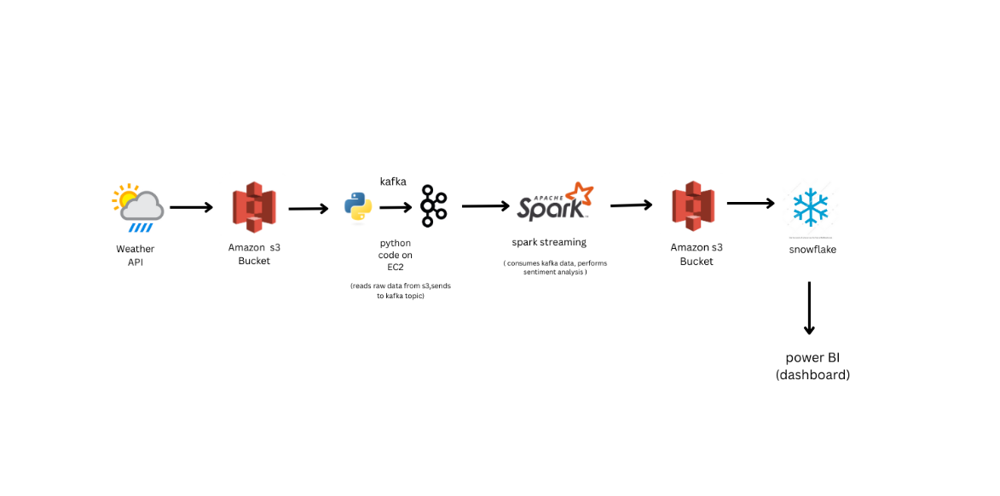

# 🌦️ Real-Time Weather Sentiment Analysis Pipeline

This project implements a real-time data pipeline that ingests weather data from an API, stores it in Amazon S3, streams it via Kafka, processes it using PySpark for sentiment analysis, and visualizes the results with Power BI, using Snowflake as the analytics layer.

## 🔧 Technologies Used

- Weather API
- Amazon S3
- EC2
- Apache Kafka
- Apache Spark (PySpark)
- Snowflake
- Power BI

## 🔄 Data Flow

[Weather API]
      ↓
[Amazon S3 Bucket: to_processed/]
      ↓
[EC2 Python Script → Kafka Topic]
      ↓
[PySpark Streaming: Sentiment Analysis]
      ↓
[Amazon S3 Bucket: processed/sentiments/]
      ↓
[Snowflake Data Warehouse]
      ↓
[Power BI Dashboard]

## 🧠 Sentiment Analysis Logic

The sentiment score is calculated using a custom Python-based algorithm without relying on external libraries like TextBlob, NLTK, or transformers.

### How it works:
- The algorithm analyzes the presence of predefined positive and negative words.
- Each word contributes to a sentiment score.
- Final sentiment is determined based on the computed polarity:

- Positive: score > 0.1  
- Neutral: -0.1 ≤ score ≤ 0.1  
- Negative: score < -0.1

## 📂 Project Files

- [lambda_kafka.py](lambda.py) — AWS Lambda function code that fetches weather from the Weather API and pushes data to Kafka on EC2.
- [glue.py](glue.py) — AWS Glue script that reads weather data from Kafka, performs sentiment analysis, and writes results to S3.
- [snowflake.sql](snowflake.sql) — SQL script used to create tables and load data into Snowflake from S3.

⚙️ Setup Instructions

AWS S3
folder name / → for raw weather API data.

folder name/sentiments/ → for enriched sentiment output.

EC2 Python Producer
Uses boto3 to read from S3.

Uses kafka-python or confluent_kafka to push to Kafka.

Kafka Setup
Hosted on EC2 or MSK.

Topic: weather_data_raw

Ensure security group allows port 9092.

PySpark Streaming Job
Runs on EMR or a Spark cluster.

Reads from Kafka, performs NLP, writes sentiment scores to S3.

Snowflake
Snowpipe or batch ingestion from processed S3 folder.

Table columns: Timestamp, City, Weather Description, Sentiment Score, etc.

Power BI
Connects directly to Snowflake.

Visualizes time-series trends, sentiment by city, etc.

  - Automation Triggers:
  - Lambda Trigger: Create a CloudWatch EventBridge rule to trigger the Lambda function every **15 minutes.
  - *Snowflake Task: Set up to run every **5 minutes* to load newly arrived S3 data.
  - *Glue Streaming Job: Automatically picks up new Kafka data as it arrives.
 

🔐 Security & Monitoring

Use IAM Roles for S3/Kafka/EC2 access.

Enable CloudWatch for logging EC2 and Spark jobs.

Monitor Kafka metrics and Spark UI.

Use Snowflake usage dashboards and Power BI alerts.

## Architecture Diagram

## ✅ Conclusion

This project demonstrates a robust, cloud-native data pipeline for real-time weather sentiment analysis. By integrating services like Amazon S3, Kafka, PySpark, Snowflake, and Power BI, it showcases end-to-end data engineering — from ingestion to insightful visualization.The custom-built sentiment analysis logic ensures flexibility and independence from third-party NLP libraries, allowing for tailored analysis of weather descriptions.Weather for academic purposes, production-grade pipelines, or learning modern data workflows, this architecture provides a scalable and adaptable foundation.

